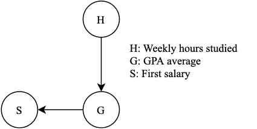

# An introduction to causality

This is the first chapter of a series of two, aiming to discuss tools to leverage invariances in a dataset to build robust predictors. 

In this first chapter we introduce the language of causality, linking the universe of `cause and effect' to probability theory. We define the probabilistic role of causal parents and formalise the concepts of causal invariance and interventional environments.
Here's the table of contents:

1. TOC
{:toc}

## Introduction
### The Generalisation quest

One of the key considerations of any predictive method is how well it performs on unseen data. Usually, to estimate the generalisation error one pools together all data collected, shuffles and separates it into a training and test set, trains the model to learn correlations between the input and the output on the former and reports the error metric on the latter. Although this approach is already indicative on whether a model is overfitting to the training data, it can lead the algorithm to absorb data collection biases, learning spurious correlations and hindering its ability to generalise to unseen situations. 

### Student GPA example
As an example, say we would like to predict student's Grade Point Average (GPA). We obtain data from two universities A and B about the amount of time the student spent studying and their first salary after leaving university. We shuffle and split the data, train an algorithm and obtain a good accuracy on the test data. We then apply the same algorithm to a third dataset collected from university C, and find that our accuracy drops. Looking into the data, we notice that students with similar GPA graduating from university A earn a first salary 10\% higher than students from university B, and 25\% higher than students from university C. This phenomenon could be explained by unoberseved variables affecting the student first salary such as location and university reputation. The result is that the correlation between the student GPA and its first salary is dependent on the environment, or, as we define it, *spurious*. Hence a model using a student first salary as a predictor is likely to fail in unseen scenarios. 

To the contrary, as a thought experiment, if students were magically forced to study less for their exams, then we would see their grades drop accordingly. Therefore the relationship between the amount of time spent studying and the student GPA is unmoved by changing environments. We say that the relationship between the study hours and the student's GPA is invariant. Treating the datasets from university A and B separately would enable us to discern spurious correlations from invariant ones and %integrate only the latter in a predictive model.
increase the robustness of our predictive model.

How can we identify and leverage invariant relationships to create more robust predictors?

### Cause and effect
In order to answer the question, consider what makes the relationship between the number of hours studied and a student's GPA. In universal wisdom, if a student studies for their course then they will achieve high grades. From a *cause and effect* optic, we intuitively know that the amount of time worked (H) is the cause of the student grade (G). If we were to doubt our intuition, a simple timeline argument supports the claim. As the studying happens before the exam, the exam cannot be the cause of the studying. We say that H is the cause of G. In addition, students with higher GPA are more likely to get higher paying jobs (S). Hence we claim that G causes S. The relationship between the three variables is depicted in Figure 1, where arrows represent causal relationships. A more in depth explanation of such causal graphs takes place in Section *Structural Equation Model and causal graphs*. 

*Figure 1: Student GPA causal graph*

What are the defining factors of the causal relationship between H and G? We will answer this question in Section *Causal parents*. In Section *Interventions* we explain how environments may change, whereas in the next Section *Invariant predictors* we discuss two methods to utilise the invariance of causal relationships to build robust predictive models across environments.

## Causality
### Causal graph and nomenclature
#### Causal parents
Following the example in the introduction, the GPA of a student is caused by the number of hours they spent studying. If the new variable 'weather' ($$W$$) is introduced, we can safely state that overall the weather has no impact on a student GPA, that is the same number of hours of study will result in the same GPA. Translating this statement in mathematical terms with variables $H$, $G$ and $W$ we obtain:

$$P(G|H, W) = P(G|H) $$

Thinking more broadly about our observational setting, the time spent studying is not the only factor affecting a student GPA. For example the student stress and difficulty of the exam are other causes of their GPA. Let us collect all variables that have a direct effect on $G$. These are all the causal parents of $G$, denoted $\text{par}(G)$. In our example, assume $\text{par}(G)=\{$ "weekly hours studied", "stress", "exam difficulty"$\}$. Similarly we can define the children of a variable as all the variables that are directly affected by it, and the ancestors and descendants of a variable as all the indirect causes and indirect effects of a variable. We can claim

$$P(G|\,\text{par}(G), Z) = P(G|\,\text{par}(G))\quad\forall Z\notin \text{par}(G)  $$

Assume a student transfers from university A to university B, where university A and B have standardised examinations, changing the observational setting. Denote by $e_1$ the first environment, and $e_2$ the second. Regardless of the location, the same student will achieve the same GPA. More generally, parents of a variable have the same effect on the variable. 

$$P(G^{e_1}|\,\text{par}^{e_1}(G)) = P(G^{e_2}|\,\text{par}^{e_2}(G))$$