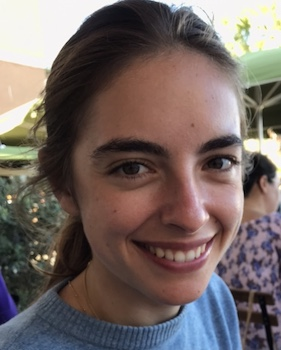

## Bio

I am a PhD student at Imperial College London in the BiomedIA group, supervised by Ben Glocker and David Sharp. 
My interest in machine learning derives from the vision of using mathematical tools and computational power to help humans make better decisions in fields affecting people's wellbeing. My resaearch focuses on the analysis of Traumatic Brain Injury (TBI) patients CT scans. I also have an interest in causality and machine explainability. 

Prior to my PhD, I graduated from an undergraduate degree in Pure Mathematics from Imperial in 2015, onboarded a short career in finance at Goldman Sachs between 2015 and 2017, then pivoted into machine learning through a masters in Data Science at ETH and my current PhD.

